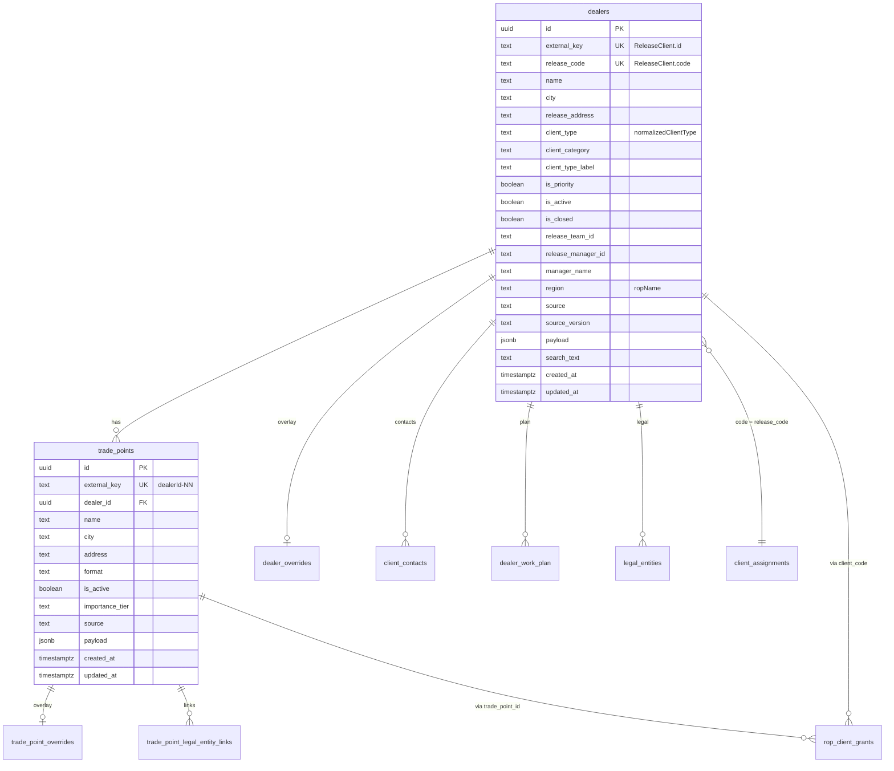

# Промт 373 — Аудит и план миграции справочника клиентов и торговых точек в БД

**Статус:** только аудит и план. DDL, миграции и изменения кода — в Промтах 374+.

**Контекст:** Tandoor — внутренний ЛК для сотрудников (ROP, manager, regional_manager, category_manager, marketer, analyst, director, admin). Клиенты/дилеры доступа не имеют.

**Цель:** перенести базовый справочник клиентов и торговых точек из TS-seed в Neon Postgres **без потерь данных**, **без видимой разницы для менеджеров**, с **zero-downtime** (двойное чтение) и **откатом за 1 минуту** (`USE_DB_DEALERS=false`).

---

## Сводка по объёмам (подсчёт из репозитория, июнь 2026)

| Источник | Файл | Строк в seed | После merge |
|---|---|---:|---:|
| Основной Excel | `release-client-seed.generated.ts` | 2743 | — |
| Импорт Котеневой | `release-client-seed-koteneva.generated.ts` | 117 | — |
| **Объединённый каталог** | `getReleaseClients()` в `release-client-data.ts` | — | **2860** |
| **Торговые точки** | `countExpectedTradePointsFromRelease()` | — | **1660** |

Правило merge: из основного сида исключаются коды, присутствующие в Koteneva; затем добавляются все 117 строк Koteneva → одна запись на `code`.

**Важно:** таблицы `dealers` / `trade_points` уже описаны в коде (Промт 348: `shared/dealers-schema.ts`, миграция `server/migrations/2026_06_05_dealers_trade_points.sql`, seed-скрипт `scripts/seed-dealers-trade-points.impl.ts`), но **UI и большинство резолверов по-прежнему читают TS-seed**, а не `/api/dealers-trade-points/*`.

---

## Раздел 1 — Инвентаризация полей seed-объекта `ReleaseClient`

Тип: `ReleaseClient = ReleaseClientSeedRow & { parsedTradePoints?: KotenevaTradePointStop[] }`  
Источники типов: `release-client-seed.generated.ts`, `release-client-data.ts`, `release-client-seed-koteneva.generated.ts`.

### 1.1. Поля строки seed (15 обязательных + 1 опциональное)

| Поле | Тип TS | Менеджер может править? | Фильтры / поиск | Маппинг в БД (`dealers`) |
|---|---|---|---|---|
| `id` | `string` | Нет (стабильный ключ) | Косвенно (scope, ссылки) | `external_key` (Промт 348) или `id` TEXT PK (целевая схема ниже) |
| `code` | `string` | Нет | Поиск (`searchText`), scope по `client_assignments` | `release_code` |
| `name` | `string` | Да — override | Поиск (`searchText`) | `name` (база); правка → `dealer_overrides.name` |
| `city` | `string` | Да — override | Фильтр города (`cities`, `city`) | `city` (база); правка → `dealer_overrides.city` |
| `address` | `string` | Нет напрямую (через ТТ / legal) | Поиск (`searchText`) | `release_address` |
| `ropName` | `string` | Частично — `dealer_overrides.rop_id` / `rop_name` (admin/seed SQL) | Фильтр РОП (косвенно через team) | `region` + `payload.ropName` |
| `managerName` | `string` | Нет в override (назначение → `client_assignments`) | Фильтр `managerId` | `manager_name` + `payload.managerName` |
| `teamId` | `string` | Нет (каталожный ключ команды) | Фильтр `teamId` | `release_team_id` |
| `managerId` | `string` | Нет (каталожный ключ менеджера) | Фильтр `managerId` | `release_manager_id` |
| `clientType` | `string` | Да — `dealer_overrides.client_category` (бизнес-категория) | Фильтр категории / deprecated `clientType` | `client_type_label` |
| `normalizedClientType` | `ReleaseClientNormalizedType` | Нет (из Excel) | Фильтр `clientType`, сегменты | `client_type` |
| `isClosed` | `boolean` | Нет (только seed; видимость закрытых — через актуализацию) | `includeClosed`, скрытие закрытых | `is_closed` |
| `isPriority` | `boolean` | Нет (только seed) | `priorityOnly` | `is_priority` |
| `isActive` | `boolean` | Нет (только seed) | `activeOnly` | `is_active` |
| `searchText` | `string` | Нет (генерируется при импорте) | Основной поиск `query` в `searchReleaseClients` | `search_text` (добавить в Промте 374) |
| `parsedTradePoints` | `KotenevaTradePointStop[]?` | Нет (только Koteneva seed; правки ТТ → overrides) | — | Денормализуется в `trade_points` (см. §2) |

### 1.2. Производные / вспомогательные поля (не в seed-файле, но в контракте)

| Поле / тип | Где | Маппинг в БД |
|---|---|---|
| `ReleaseClientNormalizedType` | enum-like union в seed | `client_type` |
| `deriveReleaseClientCategory(c)` → `ClientCategoryId` | `client-category.ts` | `client_category` |
| `ReleaseClientOptionalMapCoords` (`addressLat`, `addressLng`, `coordinatesSource`) | `release-client-data.ts` + `release-client-address-coordinates.generated.ts` | `payload.coordinates` или отдельная таблица координат (фаза 2+) |
| `RELEASE_CLIENT_SEED_META` / `RELEASE_CLIENT_KOTENEVA_SEED_META` | константы в seed-файлах | `source`, `source_version` (= `generatedAt`) |
| `DealerRow` (после `mapReleaseClientToDealerRow`) | `dealer-base-mock-data.ts` | Маппится через `dealers-trade-points-mapper.ts` в API Промта 348 |

### 1.3. Инварианты полей

- `id` всегда вида `client-ma-…` или `client-ma0000872` (Koteneva).
- `code` — `MA-MAxxxxxx` (основной) или `MA0000872` (Koteneva); связь с `client_assignments.client_code`.
- `searchText` — lowercase, поля через ` | `; используется в `matchesQuery`.
- `isClosed=true` + актуализация менеджера → клиент остаётся видимым (`hasManagerActualization`).
- Дедупликация id: при коллизии суффикс `-dup-N` (`dedupeDealerIds` / `dedupeDealerSeedBundles`).

---

## Раздел 2 — Инвентаризация полей `parsedTradePoints[]` и производных ТТ

### 2.1. `KotenevaTradePointStop` (в seed Koteneva, 20 клиентов с несколькими ТТ)

| Поле | Тип TS | Менеджер правит? | Поиск / фильтры | Маппинг в БД |
|---|---|---|---|---|
| `name` | `string` | Да — `trade_point_overrides.name` | Поиск по ТТ (global search) | `trade_points.name` |
| `city` | `string` | Да — override | Фильтр города ТТ | `trade_points.city` |
| `address` | `string` | Да — override | Поиск | `trade_points.address` |

### 2.2. Производные поля `DealerTradePoint` (runtime, `buildTradePointsFromReleaseClient`)

Для клиентов **без** `parsedTradePoints`:

- Если `address` непустой → одна ТТ `{dealerId}-01`, имя `Торговая точка · {city}`.
- Если `address` пустой → **0 ТТ** (типично для Koteneva: 39 клиентов без адреса).

| Поле `DealerTradePoint` | Источник | Менеджер правит? | Маппинг |
|---|---|---|---|
| `id` | `{ReleaseClient.id}-{NN}` | Нет | `trade_points.external_key` |
| `dealerId` | `ReleaseClient.id` | Нет | FK `trade_points.dealer_id` → `dealers` |
| `name`, `city`, `address` | seed / parsed | Да — overrides | колонки + overrides |
| `format` | константа «Розница / салон» | Нет | `trade_points.format` |
| `status`, `equipment`, KPI витрины и т.д. | синтетика пилота | Частично (витрина, комментарии) | overrides / actualization state, **не** в базовом справочнике |

### 2.3. Ключ торговой точки

- **Стабильный `tp_id`** = `external_key` = `{dealerId}-{suffix}`, suffix `01`, `02`, … (zero-padded).
- `trade_point_overrides.tp_id` = тот же ключ.
- `rop_client_grants.trade_point_id` = тот же ключ.
- `trade_point_legal_entity_links.trade_point_id` = тот же ключ.

---

## Раздел 3 — Где сейчас читается seed (карта зависимостей)

### 3.1. Прямой импорт `RELEASE_CLIENT_ROWS`

| Файл | Назначение |
|---|---|
| `client/src/lib/release-client-data.ts` | Merge основного + Koteneva → `getReleaseClients()` |
| `shared/admin/actualization-dedupe.ts` | Дедуп актуализации: сверка с полным основным сидом |

### 3.2. Импорт `RELEASE_CLIENT_ROWS_KOTENEVA` / Koteneva meta

| Файл | Назначение |
|---|---|
| `client/src/lib/release-client-data.ts` | Merge Koteneva-строк, тип `KotenevaTradePointStop` |

### 3.3. `getReleaseClients()` и производные функции (`release-client-data.ts`)

| Файл | Назначение |
|---|---|
| `client/src/lib/dealer-base-mock-data.ts` | **`DEALER_BASE_ROWS`** — главный каталог UI (`buildDealerRowsFromReleaseClients`) |
| `client/src/lib/real-client-base.ts` | Scope видимых клиентов для залогиненных пользователей |
| `client/src/lib/dealer-base-dealer-segment.ts` | Сегменты / тоны типов клиентов |
| `client/src/lib/sales-manager-kpi-data.ts` | KPI менеджера по каталогу |
| `shared/dealers-seed-logic.ts` | Seed bundles для БД (`buildAllDealerSeedBundles`) |
| `scripts/seed-dealers-trade-points.impl.ts` | Импорт в `dealers` / `trade_points` |
| `client/src/pages/release-clients.tsx` | Страница `/clients-list`: список, фильтры, сводка |
| `client/src/pages/trash-bin.tsx` | Корзина: lookup seed по `dealer_id` |
| `shared/__tests__/dealers-trade-points-api.test.ts` | Smoke: bundles ≥ release clients |
| `client/src/lib/__tests__/*` (15+ файлов) | Scope, sidebar counters, actualization, distribution |

### 3.4. `DEALER_BASE_ROWS` / `buildDealerRowsFromReleaseClients` (косвенно seed)

| Файл | Назначение |
|---|---|
| `client/src/pages/dealer-base.tsx` | `/dealer-base` — основной экран клиентской базы |
| `client/src/pages/trade-points.tsx` | `/trade-points` |
| `client/src/pages/client-map.tsx` | Карта клиентов |
| `client/src/pages/dealer-card-foundation.tsx` | Карточка клиента |
| `client/src/pages/dealer-base-manager-detail.tsx` | Деталь менеджера |
| `client/src/pages/dealer-base-management-cockpit.tsx` | Cockpit РОП/директора |
| `client/src/pages/dealer-base-city-detail.tsx` | Детализация по городу |
| `client/src/pages/tasks.tsx` | Задачи витрины (scope по дилерам) |
| `client/src/pages/sales-plan-fact-management.tsx` | План/факт |
| `client/src/pages/admin-counts-diag.tsx` | Диагностика счётчиков |
| `client/src/lib/dealer-base-working-rows.ts` | Рабочие строки с merge overrides |
| `client/src/lib/distribution-entry-scoped-rows.ts` | `/distribution` entry forms |
| `client/src/lib/trade-point-list-for-actualization.ts` | Список ТТ для актуализации |
| `client/src/lib/sidebar-nav-real-scope.ts` | Счётчики сайдбара |
| `client/src/lib/search/local-global-search.ts` | Локальный поиск |
| `client/src/lib/analytics-operational-data.ts` | Операционная аналитика |
| `client/src/lib/legal-entity-directory.ts` | Справочник юрлиц |
| `client/src/lib/order-data.ts` | Заказы (привязка к дилерам) |
| `client/src/components/distribution/distribution-entry-tradepoint-panel.tsx` | Панель ТТ в дистрибуции |
| `client/src/components/analytics/analytics-operational-panel.tsx` | Панель аналитики |

### 3.5. `RELEASE_CLIENT_ADDRESS_COORDINATES`

| Файл | Назначение |
|---|---|
| `client/src/lib/client-map-data.ts` | Координаты для `/client-map` |

### 3.6. API БД (готово, но UI не переключён)

| Файл | Назначение |
|---|---|
| `shared/dealers-trade-points-handlers.ts` | `GET /api/dealers-trade-points/list|get|summary` |
| `client/src/lib/dealers-trade-points-api.ts` | Клиентский fetch (комментарий: «NOT in use yet») |

**Функции `getReleaseClient(id)` в коде нет** — точечный lookup через `DEALER_BASE_ROWS.find` / `getDealerById`.

---

## Раздел 4 — Существующие таблицы поверх seed

Все override-таблицы используют **TEXT-ключи**, совместимые с seed id, **без FK** на базовый справочник (пока).

### 4.1. `dealer_overrides`

| Колонка | Тип | Индексы / FK |
|---|---|---|
| `dealer_id` | TEXT PK | = `ReleaseClient.id` |
| `name`, `city` | TEXT | |
| `contact_name`, `contact_phone`, `contact_email` | TEXT | |
| `general_comment` | TEXT | |
| `client_category` | TEXT | |
| `trashed_at` | TIMESTAMPTZ | |
| `trashed_by` | UUID → `users(id)` | |
| `unloading_order` | TEXT | |
| `regional_manager_id` | UUID → `users(id)` | scope RM (prompt 354) |
| `regional_manager_name` | TEXT | |
| `rop_id` | UUID → `users(id)` | добавлено миграцией seed ROP/RM |
| `rop_name` | TEXT | |
| `created_at`, `updated_at` | TIMESTAMPTZ | |
| `updated_by` | UUID → `users(id)` | |

**События:** `dealer_override_events` — `(id UUID PK, dealer_id, field, old_value, new_value, changed_by, changed_at)`; индекс `idx_dealer_override_events_dealer (dealer_id, changed_at DESC)`.

### 4.2. `trade_point_overrides`

| Колонка | Тип | Индексы / FK |
|---|---|---|
| `tp_id` | TEXT PK | = `{dealerId}-{NN}` |
| `dealer_id` | TEXT | индекс `idx_trade_point_overrides_dealer` |
| `name`, `city`, `address` | TEXT | |
| `contact_name`, `contact_phone`, `comment` | TEXT | |
| `showcase_status`, `shipment_days` | TEXT | |
| `is_main_warehouse`, `is_hardware_warehouse` | BOOLEAN | |
| `trashed_at`, `trashed_by` | TIMESTAMPTZ / UUID | |
| `rop_id`, `rop_name` | UUID / TEXT | |
| `regional_manager_id`, `regional_manager_name` | UUID / TEXT | |
| `created_at`, `updated_at`, `updated_by` | | |

**События:** `trade_point_override_events` — индекс `idx_trade_point_override_events_tp (tp_id, changed_at DESC)`.

### 4.3. `client_assignments`

| Колонка | Тип | Индексы / FK |
|---|---|---|
| `client_code` | TEXT PK | = `ReleaseClient.code` (`MA-…`) |
| `responsible_user_id` | UUID NOT NULL → `users` | `idx_client_assignments_user` |
| `team_id` | UUID → `teams` | `idx_client_assignments_team` |
| `since`, `updated_at` | TIMESTAMPTZ | |

### 4.4. `client_assignment_history`

| Колонка | Тип | Индексы |
|---|---|---|
| `id` | UUID PK | |
| `client_code` | TEXT NOT NULL | `idx_cah_client_code` |
| `from_user_id`, `to_user_id` | UUID | `idx_cah_to_user` |
| `from_team_id`, `to_team_id` | UUID | |
| `actor_user_id` | UUID | |
| `reason` | TEXT | |
| `created_at` | TIMESTAMPTZ | `idx_cah_created_at` |

### 4.5. `client_contacts` (730 строк в проде)

| Колонка | Тип | Индексы |
|---|---|---|
| `id` | UUID PK | |
| `client_id` | TEXT NOT NULL | `ix_client_contacts_client` — = `ReleaseClient.id` |
| `scope` | TEXT (`dealer` / `legal_entity` / `trade_point`) | `ix_client_contacts_scope` |
| `scope_ref` | TEXT | id ТТ или юрлица |
| `full_name`, `role`, `phone`, `whatsapp`, `telegram`, `email`, `comment` | TEXT | |
| `is_primary`, `is_actual` | BOOLEAN | |
| `source` | TEXT | |
| `delete_requested_at`, `delete_request_reason` | | |
| `created_by_user_id`, `created_by_name` | | |
| `created_at`, `updated_at` | TIMESTAMPTZ | |

### 4.6. `client_contact_events` (1512 строк)

| Колонка | Тип | Индексы |
|---|---|---|
| `id` | UUID PK | |
| `client_id` | TEXT NOT NULL | `ix_client_contact_events_client_at` |
| `scope`, `scope_ref` | TEXT | `ix_client_contact_events_scope_at` |
| `body` | TEXT | |
| `actor_user_id`, `actor_name` | | |
| `at` | TIMESTAMPTZ | |

### 4.7. `client_comments` (15 строк)

| Колонка | Тип | Индексы |
|---|---|---|
| `id` | UUID PK | |
| `client_id` | TEXT NOT NULL | `ix_client_comments_client` |
| `scope` | TEXT (`dealer` / `trade_point`) | `ix_client_comments_scope`, `ix_client_comments_tp` |
| `scope_ref` | TEXT | |
| `type`, `body` | TEXT | |
| `is_deleted` | BOOLEAN | |
| `created_by_user_id`, `created_by_name` | | |
| `created_at`, `updated_at` | TIMESTAMPTZ | |

### 4.8. `dealer_work_plan` (90 строк)

| Колонка | Тип | Индексы |
|---|---|---|
| `user_id` | UUID | PK `(user_id, dealer_id)` |
| `dealer_id` | TEXT | = `ReleaseClient.id`; `ix_dwp_user`, `ix_dwp_scheduled` |
| `is_hidden` | BOOLEAN | |
| `scheduled_date`, `scheduled_note`, `scheduled_updated_at` | | |
| `created_at`, `updated_at` | TIMESTAMPTZ | |

### 4.9. `dealer_training_state` / `trade_point_training_state`

| Таблица | PK | Поля |
|---|---|---|
| `dealer_training_state` | `dealer_id` TEXT | `product_training_done`, `needs_new_employees_training`, `updated_at`, `updated_by` |
| `trade_point_training_state` | `tp_id` TEXT | `product_training_done`, `updated_at`, `updated_by` |

### 4.10. `manual_dealers` (3 строки в проде)

| Колонка | Тип | Назначение |
|---|---|---|
| `dealer_id` | TEXT PK | Обычно `manual-dealer-{uuid}` |
| `payload` | JSONB NOT NULL | Полный снимок вручную созданного клиента (имя, город, ТТ, …) |
| `created_by` | UUID | |
| `created_at` | TIMESTAMPTZ | |

Дублируется в `client_base_actualization_state.state.manuallyCreatedDealersById` (per-user JSON). API: `POST` в `dealer-overrides-handlers.ts` → `INSERT INTO manual_dealers`.

### 4.11. `rop_client_grants` (82 строки)

| Колонка | Тип | Индексы |
|---|---|---|
| `id` | UUID PK | |
| `rop_user_id` | UUID NOT NULL → `users` | `rop_client_grants_by_rop` |
| `client_code` | TEXT | XOR с `trade_point_id`; unique `(rop_user_id, client_code)` |
| `trade_point_id` | TEXT | unique `(rop_user_id, trade_point_id)` |
| `granted_by`, `reason` | | |
| `created_at` | TIMESTAMPTZ | `rop_client_grants_by_client`, `rop_client_grants_by_tp` |

CHECK: ровно одно из `client_code` / `trade_point_id` заполнено.

### 4.12. `client_base_actualization_state`

| Колонка | Тип | Индексы |
|---|---|---|
| `id` | UUID PK | |
| `scope_key` | TEXT UNIQUE | |
| `user_id` | TEXT | `idx_cb_actualization_user_id` |
| `role` | TEXT | |
| `state` | JSONB | merge актуализации менеджера |
| `version` | INTEGER | |
| `created_at`, `updated_at` | TIMESTAMPTZ | `idx_cb_actualization_updated_at` |

### 4.13. Связанные таблицы (вне списка промта, но ссылаются на те же ключи)

| Таблица | Ключ | Связь с seed |
|---|---|---|
| `legal_entities` | `client_id` TEXT | = `ReleaseClient.id` |
| `trade_point_legal_entity_links` | `trade_point_id` TEXT | = `tp_id` |
| `dealers` (Промт 348) | `external_key` TEXT UNIQUE | = `ReleaseClient.id`; UUID `id` внутренний |
| `trade_points` (Промт 348) | `external_key` TEXT UNIQUE | = `{dealerId}-{NN}`; `dealer_id` UUID FK |

### 4.14. Сопоставление ключей override ↔ seed

```
ReleaseClient.id          = dealer_overrides.dealer_id
                          = client_contacts.client_id
                          = dealer_work_plan.dealer_id
                          = dealer_training_state.dealer_id
                          = legal_entities.client_id
                          = dealers.external_key (после seed)

ReleaseClient.code        = client_assignments.client_code
                          = rop_client_grants.client_code (когда грант на клиента)
                          = dealers.release_code

{ReleaseClient.id}-NN     = trade_point_overrides.tp_id
                          = trade_points.external_key
                          = rop_client_grants.trade_point_id (когда грант на ТТ)

Преобразование code ↔ id (используется в SQL):
  dealer_id = 'client-' || lower(client_code)   -- упрощённо; фактические id могут быть client-ma-ma085529
  client_code = upper(regexp_replace(dealer_id, '^client-', ''))
```

---

## Раздел 5 — Предлагаемая целевая схема в БД

### 5.1. Расхождение с Промтом 348

В репозитории **уже есть** схема UUID + `external_key` (см. `shared/dealers-schema.ts`). Промт 373 из ТЗ описывает упрощённую схему с TEXT PK = seed id.

**Рекомендация для 374+:** сохранить UUID PK + `external_key` (меньше breaking changes для уже написанного API и seed-скрипта), **добавить** недостающие колонки (`search_text`, `payload`, `source_version`) и индексы из ТЗ.

### 5.2. Целевая логическая модель



### 5.3. Колонки `dealers` (полный перечень после доработки 374)

| Колонка | Источник seed / логика |
|---|---|
| `external_key` | `ReleaseClient.id` |
| `release_code` | `ReleaseClient.code` |
| `name`, `city` | seed |
| `release_address` | `ReleaseClient.address` |
| `region` | `ropName` |
| `manager_name` | `managerName` |
| `release_team_id`, `release_manager_id` | `teamId`, `managerId` |
| `client_type` | `normalizedClientType` |
| `client_type_label` | `clientType` |
| `client_category` | `deriveReleaseClientCategory` |
| `status`, `format` | вычисляются в `dealers-seed-logic.ts` |
| `is_active`, `is_priority`, `is_closed` | флаги seed |
| `legal_entity`, `holding`, `comment` | денормализация из `DealerRow` |
| `source` | `release-seed` \| `release-seed-koteneva` \| `manual` |
| `source_version` | `RELEASE_*_SEED_META.generatedAt` |
| `search_text` | `ReleaseClient.searchText` |
| `payload` | `{ ropName, managerName, parsedTradePoints?, seedMeta? }` — всё, что не вынесено в колонки |

### 5.4. Колонки `trade_points`

| Колонка | Источник |
|---|---|
| `external_key` | `{dealerExternalKey}-{NN}` |
| `dealer_id` | UUID FK → `dealers.id` |
| `name`, `city`, `address` | parsedTradePoints или синтетика из address |
| `format` | «Розница / салон» |
| `is_active` | из `ReleaseClient.isActive` |
| `importance_tier` | `vip` / `growth` / `standard` из категории |
| `source` | `release-seed` / `manual` |
| `payload` | исходный объект Koteneva stop, индекс в массиве |

### 5.5. Индексы (добавить в 374)

```
dealers: (client_type), (is_active), (is_closed), (release_team_id), (release_manager_id),
         gin(search_text gin_trgm_ops), (lower(name) text_pattern_ops), (lower(city))
trade_points: (dealer_id), (lower(city)), (external_key) — уже есть
```

`client_assignments` — **без изменений** (уже в БД, ключ `client_code`).

---

## Раздел 6 — Связи и инварианты

| Связь | Проверка | Действие после миграции |
|---|---|---|
| `dealer_overrides.dealer_id` = seed id | ✓ по прод-данным | `ALTER TABLE dealer_overrides ADD FK (dealer_id) REFERENCES dealers(external_key)` или проверка через trigger |
| `trade_point_overrides.tp_id` = seed tp id | ✓ `{id}-{NN}` | FK на `trade_points.external_key` |
| `client_assignments.client_code` = `dealers.release_code` | ✓ `MA-*` | Периодическая сверка orphaned codes |
| `client_contacts.client_id` = `dealers.external_key` | ✓ | FK (опционально, TEXT) |
| `dealer_work_plan.dealer_id` = `dealers.external_key` | ✓ | FK (опционально) |
| `rop_client_grants.client_code` = `dealers.release_code` | ✓ | CHECK / периодическая сверка |
| `rop_client_grants.trade_point_id` = `trade_points.external_key` | ✓ | FK |
| `legal_entities.client_id` = `dealers.external_key` | ✓ | уже индексируется |
| `manual_dealers.dealer_id` | префикс `manual-dealer-` | `source=manual`; не обязан быть в seed |
| Count dealers | `COUNT(dealers)` = 2860 | после seed-скрипта |
| Count trade_points | `COUNT(trade_points)` = 1660 | после seed-скрипта |
| Дедуп id | `-dup-N` суффиксы | seed-скрипт и UI используют одинаковую `dedupeDealerSeedBundles` |
| Merge Koteneva | 117 кодов заменяют основной сид | `source` различает происхождение |
| Overrides поверх базы | `COALESCE(override, base)` | контракт `dealer-base-working-rows.ts` сохраняется |

---

## Раздел 7 — Стратегия zero-downtime миграции (по фазам)

### Фаза 0 — Препрод (Промт 374)

**Работы:**

1. Доработать DDL `dealers` / `trade_points`: `search_text`, `payload`, `source_version`, индексы; FK на overrides — **отложить**.
2. Доработать `scripts/seed-dealers-trade-points.impl.ts`: батчи по 500, `source` = `release-seed` / `release-seed-koteneva`, заполнение `search_text` и `payload`.
3. Прогнать seed в проде (идемпотентный UPSERT по `external_key`).
4. Сверка:
   - `SELECT COUNT(*) FROM dealers` = **2860**
   - `SELECT COUNT(*) FROM trade_points` = **1660**
   - Выборочно 50 строк: hash полей seed vs БД

**Checkpoint 0 — откат:** таблицы не подключены к UI; откат = `TRUNCATE dealers, trade_points` или просто не использовать. **Риск для менеджеров: нулевой.**

---

### Фаза 1 — Двойное чтение (Промт 375)

**Работы:**

1. Env `USE_DB_DEALERS` (default `false`).
2. В точках входа (`getReleaseClients`, `DEALER_BASE_ROWS` builder, `/api/dealers-trade-points/*`) при `USE_DB_DEALERS=true` читать БД, иначе seed.
3. В dev/staging: параллельное чтение обоих источников, лог расхождений (поле, id, expected/actual).
4. Snapshot-тесты: JSON `DealerRow[]` seed vs DB mapper.

**Checkpoint 1 — откат:** `USE_DB_DEALERS=false` → мгновенный возврат на seed. **Условие перехода к Фазе 2:** 0 критичных расхождений за 48 ч в staging + smoke тесты green.

---

### Фаза 2 — Переключение чтения на БД (Промт 376)

**Работы:**

1. `USE_DB_DEALERS=true` в проде.
2. Мониторинг 24–48 ч: 5xx на `/api/dealers-trade-points/*`, жалобы менеджеров, сверка счётчиков сайдбара.
3. Runbook для поддержки: скриншоты `/dealer-base`, `/trade-points` до/после.

**Checkpoint 2 — откат:** вернуть `USE_DB_DEALERS=false` в env → **откат за ~1 минуту** без редеплоя схемы. Seed-файлы остаются в бандле.

**Условие перехода к Фазе 3:** стабильная работа ≥ **14 дней**, нет P1 инцидентов по каталогу.

---

### Фаза 3 — Удаление seed (Промт 377)

**Работы:**

1. Удалить `release-client-seed.generated.ts`, `release-client-seed-koteneva.generated.ts`, `release-client-address-coordinates.generated.ts`.
2. Заменить `release-client-data.ts` на тонкую обёртку над DB API с тем же контрактом `ReleaseClient` / `ReleaseClientSearchFilters`.
3. Упростить резолверы; CI без 2.2 МБ seed в бандле.

**Checkpoint 3 — откат:** **невозможен быстро** без отката git/deploy. Поэтому Фаза 3 только после 14 дней Фазы 2. Аварийный откат — redeploy предыдущего релиза с seed-файлами (держать артефакт ≥ 30 дней).

---

## Раздел 8 — Что менеджер делает с базой сегодня (контракт UI)

| Действие | Экран / код | Куда пишется | После миграции |
|---|---|---|---|
| Видит список клиентов, фильтры (город, РОП, тип, приоритет) | `/dealer-base`, `/clients-list` — `searchReleaseClients`, `dealer-base.tsx` | Чтение seed + merge overrides | ✓ БД вместо seed; фильтры через `/api/dealers-trade-points/list` |
| Поиск по имени/коду/городу | `searchText` / local search | seed | ✓ `search_text` + gin_trgm |
| Правит имя, город, телефон, email, комментарий | Карточка клиента — `use-dealer-field-saver.ts` → `/api/dealer-overrides` | `dealer_overrides` | ✓ Без изменений (override поверх base) |
| Меняет бизнес-категорию клиента | `dealer-card-foundation.tsx` → `client_category` | `dealer_overrides.client_category` | ✓ |
| Переназначает ответственного | Admin / assignments API | `client_assignments` + `client_assignment_history` | ✓ |
| Назначает РОП/РМ на дилера или ТТ | Responsibility UI | `dealer_overrides.rop_id`, `regional_manager_id`, TP overrides | ✓ |
| Добавляет контакт | Карточка клиента | `client_contacts`, `client_contact_events` | ✓ `client_id` = `external_key` |
| Комментарии по клиенту/ТТ | Карточка | `client_comments` | ✓ |
| Убирает клиента в корзину | Trash flow | `dealer_overrides.trashed_at` | ✓ |
| Создаёт клиента вручную | Актуализация / dealer-base | `manual_dealers` + `client_base_actualization_state` | ✓ `source=manual` в `dealers` (374+) |
| Добавляет / правит ТТ | Актуализация, карточка ТТ | `trade_point_overrides` (и state JSON) | ✓ Базовые ТТ из `trade_points`; правки в overrides |
| План работы по клиенту (скрыть, дата визита) | Dealer work plan | `dealer_work_plan` | ✓ |
| Обучение продукту | Training UI | `dealer_training_state`, `trade_point_training_state` | ✓ |
| Закрытый / приоритетный статус | Только отображение | **seed** (`isClosed`, `isPriority`) — менеджер **не** пишет в БД | ✓ Значения из `dealers.is_closed`, `dealers.is_priority` (импорт из seed) |
| Витрина / дистрибуция / showcase history | `/distribution`, `/showcase-history`, мастер витрины | Scope по `DealerRow.id` / `tp_id` | ✓ Стабильные `external_key` сохраняются |
| Карта клиентов | `/client-map` | seed + `RELEASE_CLIENT_ADDRESS_COORDINATES` | ⚠ Координаты — отдельный follow-up (payload или таблица) |
| Счётчики сайдбара | `sidebar-nav-real-scope.ts` | seed + assignments | ✓ После переключения — DB count |

---

## Раздел 9 — Что добавляется в БД, чего там сейчас нет

| Данные | Сейчас | После миграции |
|---|---|---|
| Базовые name/city/address/code **2860** клиентов | TS-seed 2.2 МБ | `dealers` (~2860 rows) |
| Базовые name/city/address **1660** ТТ | Вычисляются в runtime | `trade_points` (~1660 rows) |
| `clientType` / `normalizedClientType` | seed | `client_type_label`, `client_type` |
| `isPriority` / `isClosed` / `isActive` | seed | `is_priority`, `is_closed`, `is_active` |
| Связь dealer ↔ trade_point | В памяти (`DealerRow.tradePoints`) | FK `trade_points.dealer_id` |
| `searchText` | seed only | `dealers.search_text` |
| `ropName`, `teamId`, `managerId` (каталожные) | seed only | колонки + `payload` |
| `parsedTradePoints` (Koteneva) | seed JSON | строки `trade_points` + `payload` |
| `RELEASE_CLIENT_ADDRESS_COORDINATES` | отдельный TS | **не в scope 374** — оставить файл до отдельного промта |

**Уже в БД (не трогаем):** все override/assignment/contact таблицы из §4.

---

## Раздел 10 — Риски и митигация

| Риск | Митигация |
|---|---|
| Менеджер заметит разницу в порядке/тексте | Точный маппинг §1–2; snapshot-тест `DealerRow[]` seed vs DB; сохранить sort order (`release_code`, `name`) |
| Override-таблицы потеряют связь | FK в 374+; preflight `SELECT dealer_id FROM dealer_overrides EXCEPT SELECT external_key FROM dealers` |
| Откат после Фазы 3 невозможен за 1 мин | Не удалять seed до 14 дней стабильной Фазы 2; хранить deploy artifact |
| Поиск медленнее в БД | `gin_trgm` на `search_text`; кэш summary на API |
| Импорт долгий | UPSERT батчами по 500; ожидание < 30 с для 2860+1660 |
| Расхождение Промт 348 UUID vs TEXT PK | Оставить UUID + `external_key`; UI продолжает использовать string id |
| Koteneva merge (117 замен) | `source=release-seed-koteneva`; сверка по `code` |
| Клиенты без ТТ (пустой address) | 0 rows в `trade_points` — как сейчас в UI |
| `manual_dealers` (3 шт.) | Импорт с `source=manual`; не смешивать с release-seed |
| Координаты карты | Файл координат остаётся до отдельной миграции |
| `getReleaseClients()` в 30+ тестах | Фаза 1: wrapper с dual-read; Фаза 3: test fixtures из DB snapshot |

---

## Раздел 11 — Список следующих промтов

| Промт | Содержание |
|---|---|
| **374** | DDL доработка `dealers` + `trade_points`, доработка `seed-dealers-trade-points`, прогон в проде, preflight FK, сверка COUNT |
| **375** | Feature flag `USE_DB_DEALERS`, dual-read резолверы, лог сверки, snapshot-тесты |
| **376** | `USE_DB_DEALERS=true` в проде, мониторинг, runbook отката |
| **377** | Удаление seed-файлов, обёртка `getReleaseClients()` → DB, упрощение бандла |

---

## Приложение A — Файлы seed и метаданные

```
apps/platform/client/src/lib/release-client-seed.generated.ts      # 2743 rows, ~2.2 MB
apps/platform/client/src/lib/release-client-seed-koteneva.generated.ts  # 117 rows
apps/platform/client/src/lib/release-client-data.ts                 # merge + API
apps/platform/client/src/lib/release-client-address-coordinates.generated.ts
apps/platform/shared/dealers-seed-logic.ts                          # seed → DB mapping
apps/platform/scripts/seed-dealers-trade-points.impl.ts           # UPSERT script
apps/platform/server/migrations/2026_06_05_dealers_trade_points.sql
```

## Приложение B — Чек-лист готовности к 374

- [ ] Все 2860 `external_key` уникальны после dedupe
- [ ] Все 1660 `trade_points.external_key` уникальны
- [ ] Нет orphaned `dealer_overrides.dealer_id`
- [ ] Нет orphaned `trade_point_overrides.tp_id`
- [ ] `client_assignments.client_code` ⊆ `dealers.release_code`
- [ ] Seed-скрипт помечает `source` для Koteneva-строк
- [ ] `search_text` заполнен для всех dealers

---

*Документ сгенерирован в рамках Промта 373. Изменения приложения не вносились.*
